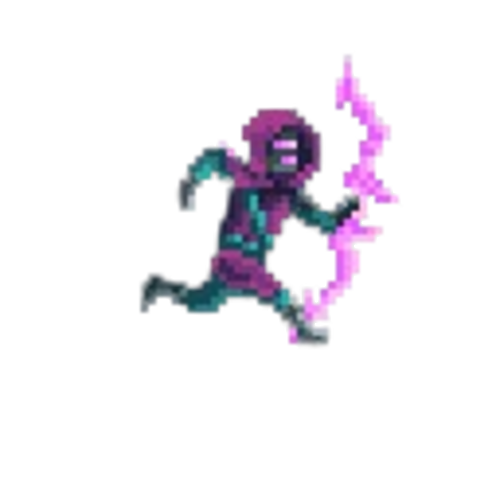
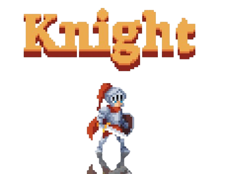
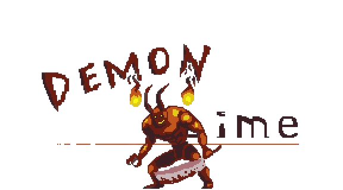

# 🌴 Jungle Adventure

**Jungle Adventure** là một tựa game 2D chiến đấu dựa trên Street Fighter được phát triển bằng C++ và SDL2. Người chơi sẽ hóa thân thành một Warrior hoặc Archer để chiến đấu chống lại các boss đáng sợ trong rừng sâu, thu thập xu, mua vật phẩm, và giải cứu khu rừng khỏi thế lực bóng tối!

---

## 🚀 Tính năng nổi bật

- 🎮 **Chọn nhân vật**:
  ### 🏹 Archer
  
  - Một cung thủ tinh anh với khả năng bắn tên tầm xa, tốc độ cao và kỹ năng **Roll** để né tránh nhanh nhẹn.
  - Kỹ năng **Rage** giúp tăng tốc độ bắn trong thời gian ngắn.

  ### 🛡️ Warrior
  
  - Một chiến binh mạnh mẽ với thanh kiếm và khiên, có khả năng **Defend** chặn đòn từ boss.
  - Kỹ năng **Rage** gia tăng sát thương và đánh liên hoàn.

- 🐉 **Boss chiến hấp dẫn**:
  ### 😈 Flying Demon
  
  - Một ác quỷ bay lượn, tấn công từ xa bằng fireball, bay qua lại và tấn công bất ngờ.

  ### 🔥 Demon Slime
  
  - Một slime khổng lồ bốc lửa, có khả năng **triệu hồi thiên thạch** và gây sát thương lớn khi áp sát.

- 🛒 **Cửa hàng vật phẩm**:
  - Tăng máu, tăng sát thương, tăng tốc độ, tạo khiên chắn sát thương.

- 🧠 **Hệ thống Rage**: Tăng dần theo thời gian.

- 💥 **Hiệu ứng**: Va chạm, rung màn hình, âm thanh sống động.

---

## 🎮 Cách chơi

| Phím | Chức năng                                  |
|------|---------------------------------------------|
| A/D  | Di chuyển trái/phải                         |
| SPACE | Nhảy                                       |
| J    | Tấn công (Warrior) / Bắn tên (Archer)       |
| L    | Đỡ đòn (Warrior) / Lăn né (Archer)          |
| I    | Kích hoạt Rage                              |
| ESC  | Tạm dừng                                    |
| H    | Hiện/tắt bảng hướng dẫn điều khiển          |

---

## 🛠️ Hướng dẫn cài đặt & chạy game

### Yêu cầu:
- Hệ điều hành: Windows / Linux
- Cài sẵn: `SDL2`, `SDL2_image`, `SDL2_mixer`, `SDL2_ttf`
- Trình biên dịch C++ hỗ trợ C++17 trở lên

### Trên Linux:
```bash
sudo apt install libsdl2-dev libsdl2-image-dev libsdl2-mixer-dev libsdl2-ttf-dev
g++ main.cpp -o JungleAdventure -lSDL2 -lSDL2_image -lSDL2_mixer -lSDL2_ttf
./JungleAdventure
```

### Trên Windows:
- Cài đặt SDL2 và các thư viện đi kèm.
- Dùng IDE như Visual Studio, Code::Blocks hoặc MinGW.
- Thêm thư viện `.lib` và include đúng thư mục `SDL2`, cấu hình path đầy đủ.
- Build và chạy.

---

## 📁 Cấu trúc thư mục

```
├── main.cpp                # Entry point
├── game.h                 # Điều khiển toàn bộ trò chơi
├── graphics.h             # Xử lý vẽ và texture
├── archer.h / warrior.h   # 2 lớp nhân vật có thể chơi
├── flyingdemon.h / demonslime.h  # Các boss chính
├── asteroid.h             # Thiên thạch do Demon Slime tạo ra
├── controls.h             # Điều khiển phím
├── defs.h                 # Hằng số định nghĩa toàn cục
├── assets/                # Hình ảnh, nhạc, âm thanh, font
└── README.md              # Tài liệu này
```

---

## 🏆 Mục tiêu trò chơi

- Chọn nhân vật phù hợp với phong cách của bạn.
- Vượt qua từng stage và đánh bại boss cuối cùng.
- Mua vật phẩm từ shop để nâng cấp sức mạnh.
- Trở thành huyền thoại của khu rừng!

---
